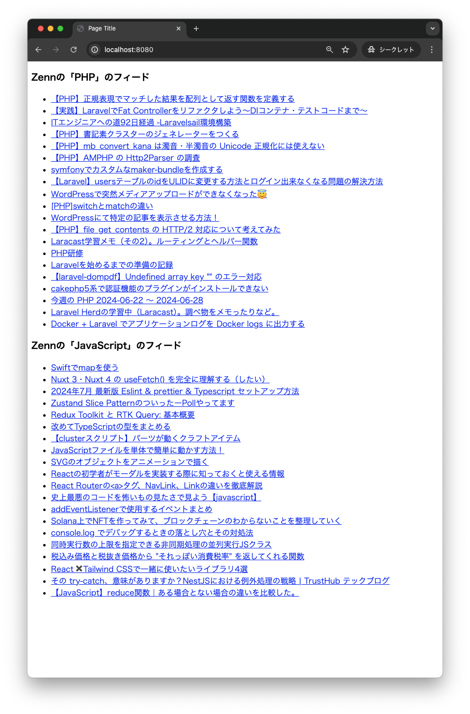

# php-zenn-rss

## 概要

このアプリは、[Zenn](https://zenn.dev)のRSSフィードを取得し、HTML形式で表示します。  
サンプルでは、`php`と`javascript`のフィードを対象にしています。



## 環境

- Dockerイメージタグ
  - [php:8.3-apache](https://hub.docker.com/layers/library/php/8.3-apache/images/sha256-a85518accca8f168d11ff0f7539bdbb015427cd162718725ba9edf9cbd960da8?context=explore)

## 実行方法

以下のコマンドを実行してアプリを起動します：

```shell
docker container run --name php-zenn-rss --rm -d -p 8080:80 --mount type=bind,src=$(pwd)/web,dst=/var/www php:8.3-apache
